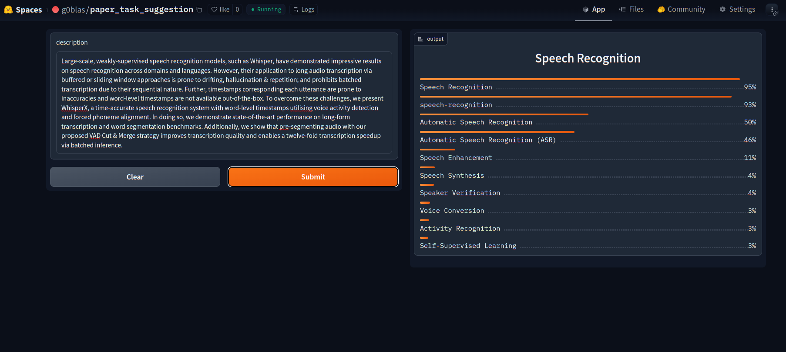
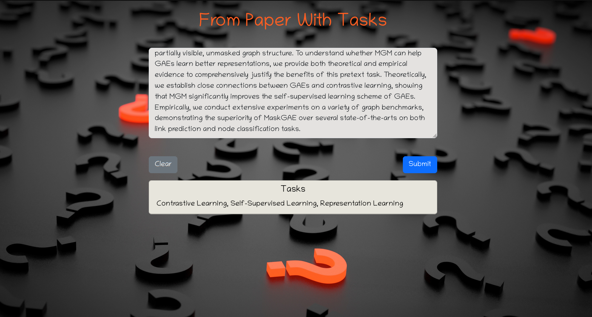

# Multilabel Task Classifier from Paper Abstract 
 

<h1 align='center' style=color:#fe5e21;><strong>From Paper With Tasks</strong></h1>

A text classification model from data collection, model training, and deployment.  
The model can classify **260** different types of paper tasks  The keys of `json_files/task_types_encoded.json` shows the paper tasks
 

 <h2 style=color:#fe5e21;>Data Collection</h2>

Data was collected from [paperswithcode](https://www.paperswithcode.com)

Data was collected from the categoreis below:
1. [*Computer Vision*](https://paperswithcode.com/methods/area/computer-vision)
    * Convolutional Neural Networks
    * Generative Models
    * Image Model Blocks
    * Object Detections Models
    * Image Feature Extractors
  

2. [*Natural Language Processing*](https://paperswithcode.com/methods/area/natural-language-processing)
    * Language Models
    * Transformers
    * Word Embeddings
    * Attention Patterns
    * Sentence Embeddings
  

3. [*Reinforcement Learning*](https://paperswithcode.com/methods/area/reinforcement-learning)
    * Policy Gradient Methods
    * Off-Policy TD Control
    * Reinforcement Learning Frameworks
    * Q-Learning Networks
    * Value Function Estimation
  

4. [*Audio*](https://paperswithcode.com/methods/area/audio)
    * Generative Audio Models
    * Audio Model Blocks
    * Text-to-Speech Models
    * Speech Separations Models
    * Speech Recognition
  

5. [*Sequential*](https://paperswithcode.com/methods/area/sequential)
    * Recurrent Neural Networks
    * Sequence to Sequence Models
    * Time Series Analysis
    * Temporal Convolutions
    * Bidirectional Recurrent Neural Networks
  

6. [*Graphs*](https://paperswithcode.com/methods/area/graphs)
    * Graph Models
    * Graph Embeddings
    * Graph Representation Learning
    * Graph Data Augmentation
  

The scripts I've used to scrape the data can be found in the [`scrapers`](https://github.com/Tasfiq-K/from-paper-with-tasks/tree/main/scrapers) directory. 

In total, I scraped **34k+** paper abstracts and other informations.

<h2 style=color:#fe5e21;>Data Processing</h2>

Initially there were *2186* different tasks in the dataset. After some analysis, I found out *1926* of them are rare (They showed up less than 30 times in the dataset). So, I removed those tasks making the tasks count equals to *260*. After that, I removed the description without any tasks. I also removed duplicate rows and cases where there were no task(s) provided. So, the resulting dataset contained total of *16304* samples.

The `papersWithCode_data.csv` is the generated dataset after the scraping. Which can be found inside the [`csv_files`](https://github.com/Tasfiq-K/from-paper-with-tasks/tree/main/csv_files) directory

<h2 style=color:#fe5e21;>Modeling</h2>

Finetuned a `distilrobera-base` model from HuggingFace Transformers using Fastai and Blurr. The model training notebook can be viewed [here](https://github.com/Tasfiq-K/from-paper-with-tasks/tree/main/notebooks/multilabel_text_classification.ipynb)

Also, checkout other notebooks in the [`notebooks`](https://github.com/Tasfiq-K/from-paper-with-tasks/tree/main/notebooks) directory.

<h2 style=color:#fe5e21;>Model Compression & ONNX Inference</h2>

The trained model has a memory of **400+MB**. I compressed this model using ONNX quantization and brought it under **85MB**. 

<h2 style=color:#fe5e21;>Deployment</h2>

The compressed model is deployed to HuggingFace Spaces Gradio App. The implementation can be found in [`deployment`](https://github.com/Tasfiq-K/from-paper-with-tasks/tree/main/deployment) folder or [here](https://huggingface.co/spaces/g0blas/paper_task_suggestion) 

<h2 style=color:#fe5e21;>Web Deployment</h2>

Deployed a Flask App built to take abstract and show the tasks of the paper as output. Check [`flask`](https://github.com/Tasfiq-K/from-paper-with-tasks/tree/flask) branch. The website is live [here](https://from-paper-with-tasks.onrender.com/) 

*Background Image Credit: The image used as the background is not mine. It was taken from [here](https://wallpapersden.com/question-marks-figures-3d-wallpaper/1920x1080/)